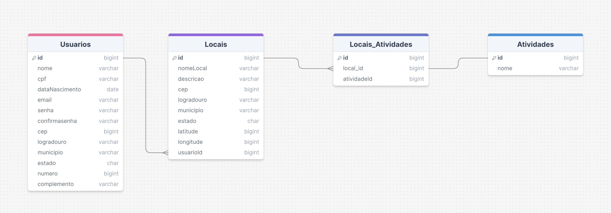

# ExerciseOpenAir

## About ExerciseOpenAir-Backend

_ExerciseOpenAir-Backend_ is an API for registering exercise locals. It allows users to see all registered locals on the platform and register their contributions. This app was developed as a final project in the academy Senai, FMT.

## Problem solved

Finding the appropriate locals to make execises could be challenging. ExerciseOpenAir solves this problem by providing a friendly platform that lists locals for physics activities.

## Tecnologias Utilizadas

- _Back-end:_ NodeJS e Express
- _APIs:_ ViaCep e Awesomeapi para consultas de Cep e localização.
- _Banco de Dados:_ PostgreSQL
- _Swagger:_ para documentação da API
- _Docker:_ para containers


## Modelo de Dados



## Estrutura do Projeto

```
├── src 
    ├── assets
    ├── config
    │   └── docs
    ├── controllers
    │   └── AtividadeController.js
    │   └── UsuarioController.js
    │   └── LocalController.js
    │   └── LoginController.js  
    ├── database
    │   ├── migrations
    │   │   └── 20240711221146-create-table-usuarios.js
    │   │   └── 20240723234214-create-table-locais.js
    │   │   └── 20240724202635-create-table-atividades.js
    │   │   └── 20240724202647-create-table-local_atividades.js          
    │   └── seeds
    │       └── 20240724215754-usuarios.js
    │       └── 20240726205241-atividades.js    
    ├── middlewares
    ├── models
    │   └── Atividade.js
    │   └── Local.js
    │   └── Usuario.js
    │   └── LocalAtividade.js            
    ├── routes
    │   └── atividades.routes.js
    │   └── locals.routes.js    
    │   └── login.routes.js
    │   └── routes.js
    │   └── usuarios.routes.js            
    ├── services
├── index.js
├── server.js
├── .env_example
├── .gitignore
├── .sequelizerc
├── package-lock.json
├── package.json
├── README.md

```


## Como Executar

## Pré-requisitos

- NodeJS
- PostgreSQL

## Passos para Executar

1. Clone o repositório para sua máquina local.
2. Ajuste as configurações do .env para o seu ambiente.
3. Instale as dependências com: ```npm install```.
4. Execute o comando npm run start:db para criar o banco de dados e popular as tabelas.
5. Gerar a documentação da API com: ```npm run swagger```.
6. Inicie o servidor com: ```npm run start:dev```.
7. Acesse [http://localhost:3000/docs/](http://localhost:3000/docs/) para visualizar a documentação em seu navegador.

##### OBS: Realizar os passos 1 a 5 apenas uma vez.

# Passos para Desenvolver 

1. Abrir o terminal no diretório do projeto
2. Digite: docker-compose up -d --build

## Melhorias Futuras

- _Integração com Front-end:_ Fazer integração com o front-end.
- _Projeto:_ Melhorar a organização do projeto e separar bem as responsabilidades.
- _Testes:_ Incluir testes unitários e integrados.

## Contribuições

Contribuições são sempre bem-vindas!

## Autores

- [@TThaz](https://www.github.com/TThaz)
- [@douglascugliarisenai](https://www.github.com/douglascugliarisenai) 
- [@alanamandimifsc](https://www.github.com/alanamandimifsc) 
- [@frankosorio4](https://www.github.com/frankosorio4) 
